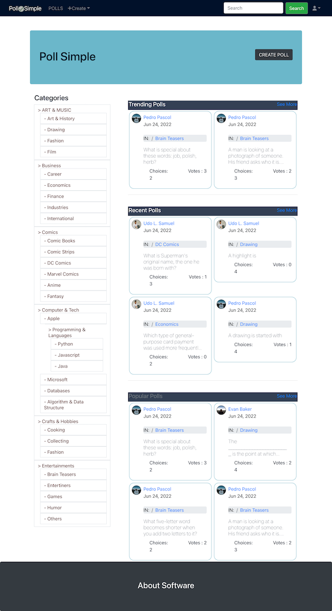
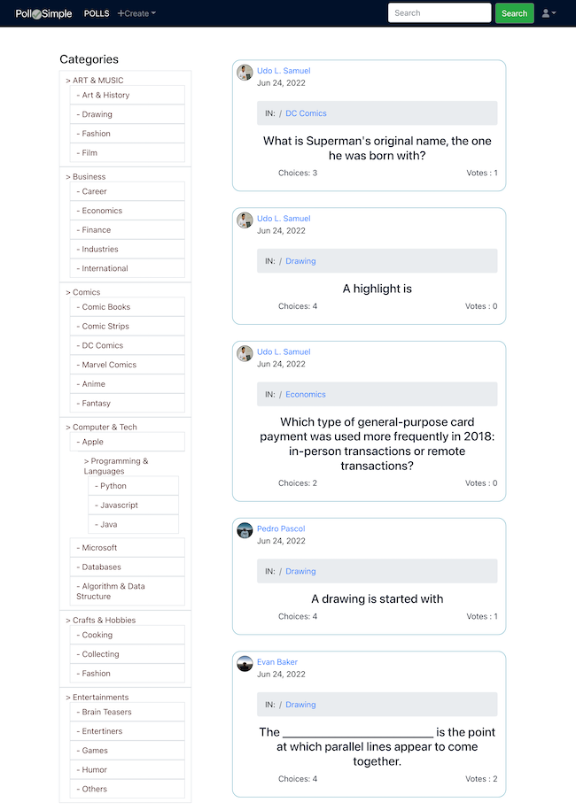
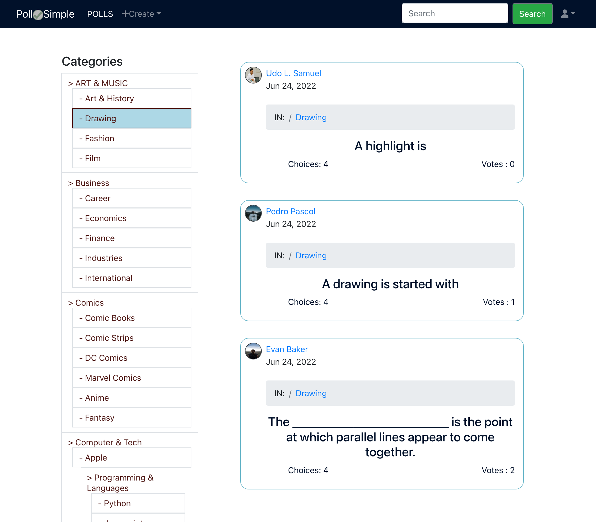
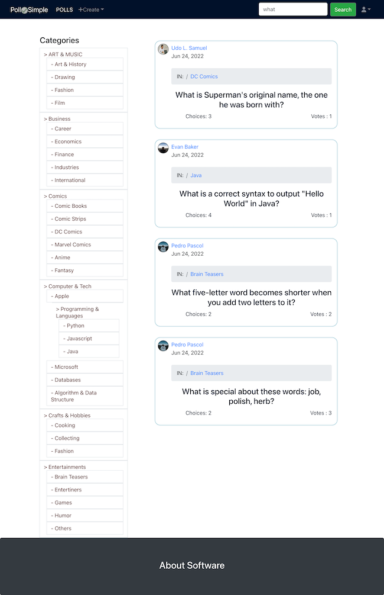
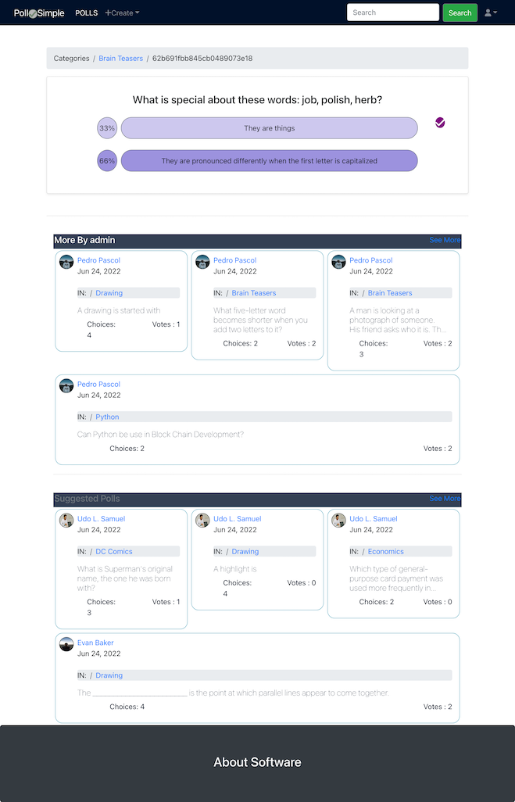
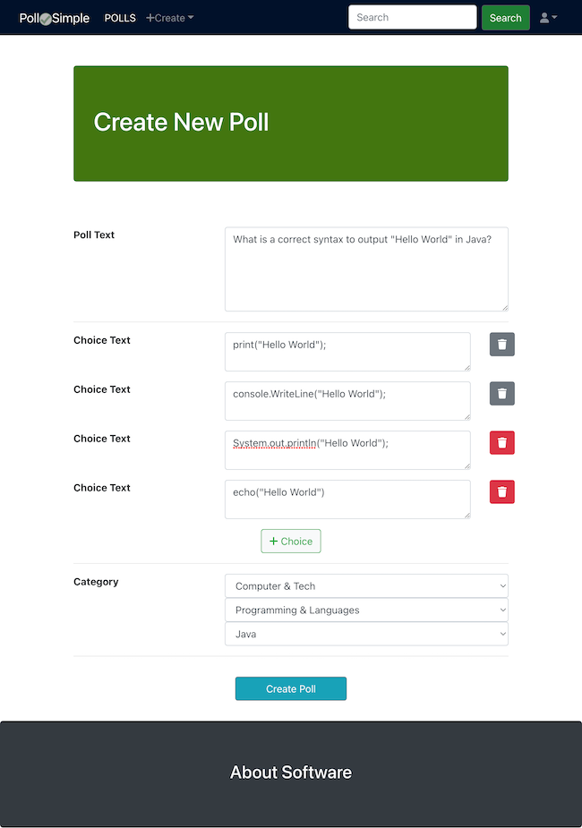
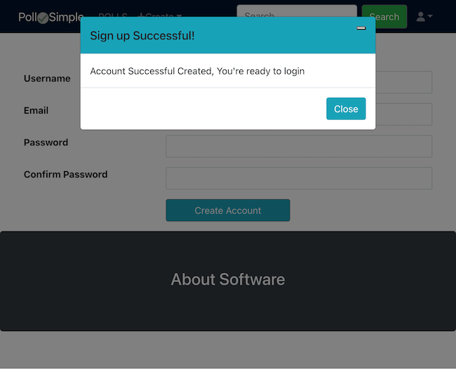
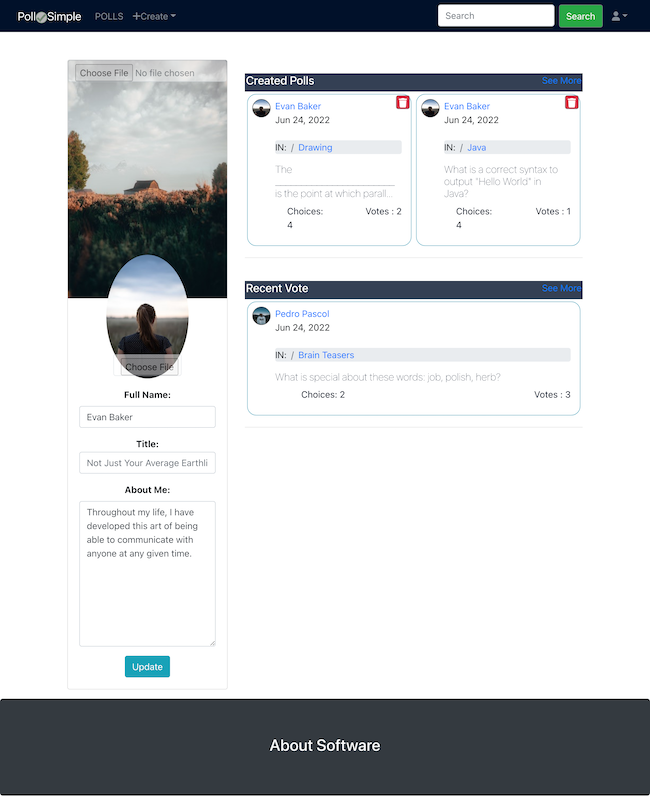
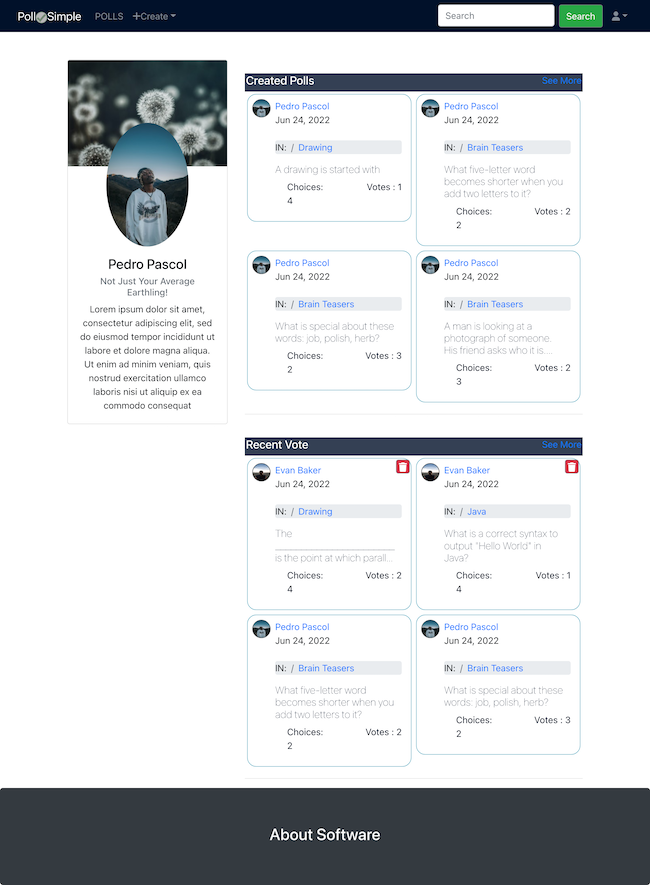

<h1>Polling App (FULL-STACK MERN SPA)</h1>
<h2>Description</h2>
A simple SPA web platform to ask questions, polls and connect with people who contribute unique insights and quality response. Computer-assisted survey information collection (CASIC) application.
This Application is the front end aspect of a MERN fullstack application see https://github.com/snipersenpai/POLLAP_FULL_STACK for the backend portion (with full openAPI specification API documentation).
<h2>Demo</h2>

  

  

  

  

  

  

  

  

  

<h2>Developer Team</h2>
<ul>
<li>
  Fully Developed By Me
</li>
</ul>
<h2>Technologies Used</h2>
<ul>
  <li >
    Bootstrap (reactstrap)
  </li>
  <li >
    HTML5
  </li>
  <li>
    CSS
  </li>
  <li>
    MongoDB
  </li>
  <li>
    Express.js
  </li>
  <li>
    Node
  </li>
  <li >
    Javascript
  </li>
  <li >
    React
  </li>
  <li >
    Redux
  </li>
</ul>
<h2>App Features</h2>
<ul >
  <li >
    Single Page Application (SPA)
  </li>
  <li >
    Modern, Stylish, interactive and yet simple UI design
  </li>
  <li>
    Login, Register and Authentication Capabilities (Passport.js JWT)
  </li>
  <li >
    Content Management System (CMS)
  </li>
  <li >
    Create, edit and manage polls, poll contents and votes
  </li>
  <li >
    Search and Filter Contents
  </li>
</ul>
